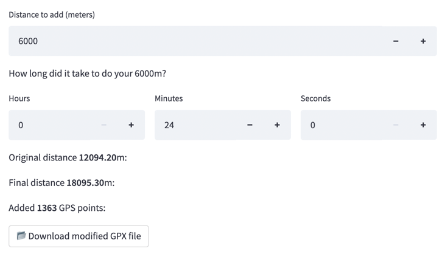

# GPX files distance modifier

[](https://share.streamlit.io/davide97l/gpx-distance-modifier/main)

👉 Has it ever happened that your watch stopped or had ant malfunction during your workout, thus **losing part** of your activity? Or has it happened that due to bad GPS signal your watched recorded a **shorter distance** than your actual one? 🤔

👉 Imagine that, after a maximal effort, you have just broken your 10km PB but your watch only recorded 9.8km, thus failing to register your record. How would you feel? Satisfied because you know you made it but probably a little disappointed because you can't show it 😥.

👉 The goal of this application is to **modify** the **gpx file** of your activity in order to add the distance that has not been recorded, while leaving your original trajectory. Don't let your app lose track of your progress! ✊

👉 Feel free to report any bug or suggestion on [Github](https://github.com/davide97l/gpx-distance-modifier) and leave a ⭐ if you found it useful.

<p align="center">
    
</p>

<h3 align="center">
    Try it out: <br>
    <a href="https://share.streamlit.io/davide97l/gpx-distance-modifier/main">https://share.streamlit.io/davide97l/gpx-distance-modifier/main</a>
</h3>

## Features

- Automatic GPX files distance modifier
- Easy upload and download of your modified file
- Clean and user-friendly interface
- The author has over 10 years or running experience including track, road, and trail running

---

## Usage

Clone this repository and set up the environment:
```bash
git clone https://github.com/davide97l/gpx-distance-modifier
cd gpx-cleaner
pip install -e requirments.txt
```
Run it locally:
```bash
streamlit run streamlit_app.py
```

---

## Support
If you found this project interesting please support me by giving it a :star:, I would really appreciate it :grinning:


 
